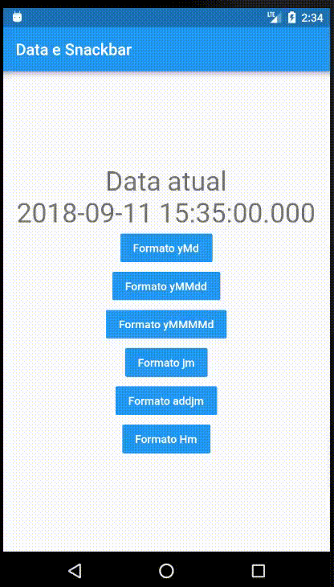

# Data Hora Snackbar



lib utilizada
- intl: ^0.15.7

Exemplos:

```Dart
// Pattern                           Result
 new DateFormat.yMd();             // -> 7/10/1996
 new DateFormat("yMd");            // -> 7/10/1996
 new DateFormat.yMMMMd("en_US");   // -> July 10, 1996
 new DateFormat.jm();              // -> 5:08 PM
 new DateFormat.yMd().add_jm();    // -> 7/10/1996 5:08 PM
 new DateFormat.Hm();              // -> 17:08
```

## Getting Started

For help getting started with Flutter, view our online
[documentation](https://flutter.io/).
