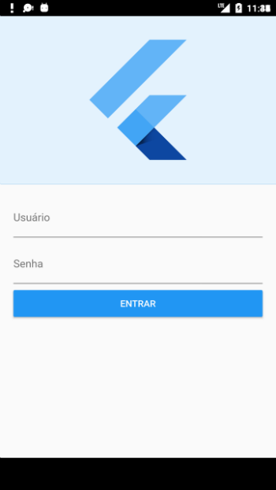
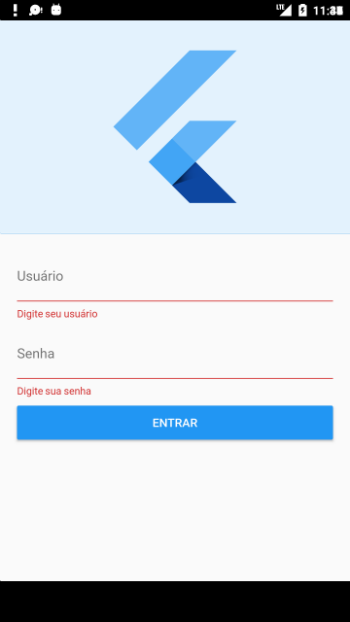

# Tela de Login

Tela de login Flutter
Foi utilizado:

1. Validação
1. Transição entre telas
1. Mascára de senha

## Getting Started

For help getting started with Flutter, view our online
[documentation](https://flutter.io/).
